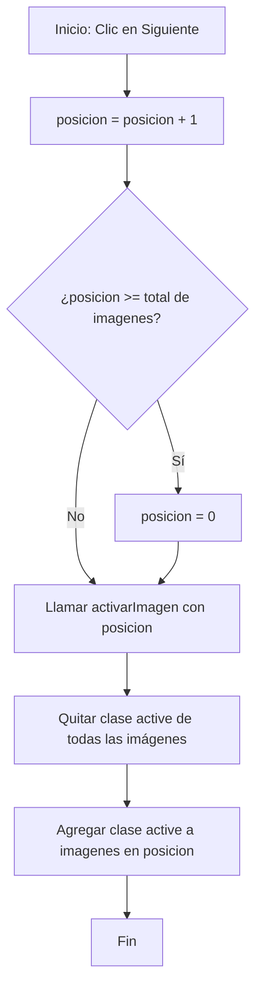
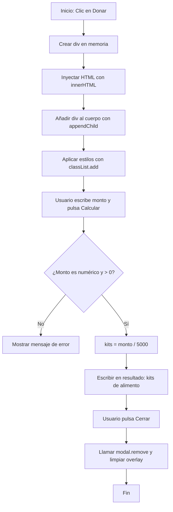

# Guía de Estudio y Defensa de Examen: Proyecto Refugio Patitas Limpias

Esta guía está diseñada para que puedas defender con éxito el proyecto de la ONG en tu examen parcial o final. Aquí se detalla la teoría y la práctica de cada punto de la lista de verificación (checklist) requerida por la cátedra, mostrando exactamente dónde y cómo se implementó en tu código de la carpeta **`V5`**.

---

## 📌 1. Posicionamiento CSS: Static, Relative y Absolute

El posicionamiento determina cómo se colocan los elementos en el navegador.

### Teoría para el Examen:
- **`static` (Por defecto):** El elemento sigue el flujo normal del documento. No le afectan las propiedades `top`, `bottom`, `left`, `right` ni `z-index`.
- **`relative` (Relativo):** El elemento se posiciona relativo a su ubicación original en el flujo normal. Si le aplicás `top: 10px`, se desplaza 10px hacia abajo desde donde debería estar, pero sigue ocupando su espacio original en el flujo normal (no afecta a los elementos vecinos).
- **`absolute` (Absoluto):** El elemento se retira por completo del flujo normal del documento (no ocupa espacio). Se posiciona relativo a su **ancestro posicionado más cercano** (es decir, el primer ancestro que tenga un posicionamiento distinto a `static`, que generalmente se define como `position: relative`). Si no tiene ningún ancestro posicionado, se posiciona relativo al elemento `<body>`.

### Dónde se usa en tu Proyecto (`V5/`):
En el **Carrusel de Fotos** de la página de inicio ([index.html](file:///c:/Users/lucas/OneDrive/Escritorio/UADE/2026/desarrollo_web_TP2/ong/V5/index.html)):
- El contenedor del carrusel tiene `position: relative;` para actuar como punto de referencia:
  ```css
  .galeria {
      position: relative;
      max-width: 100%;
      height: 60vh;
  }
  ```
- Los botones de anterior y siguiente tienen `position: absolute;` para ubicarse por encima de las imágenes del carrusel:
  ```css
  #botonAnt {
      position: absolute;
      left: 20px;
      top: 50%;
      transform: translateY(-50%);
  }
  ```

> [!TIP]
> **Pregunta del Profesor:** *¿Por qué el contenedor `.galeria` tiene `position: relative`?*
> **Tu Respuesta:** *Tiene `position: relative` para servir como ancestro de referencia (punto de anclaje) para los botones `#botonAnt` y `#botonSig`. Si no tuviera `relative`, los botones con `position: absolute` se posicionarían respecto a toda la pantalla en lugar de quedarse dentro del contenedor del carrusel.*

---

## 📌 2. Posicionamiento CSS: Fixed y Sticky

### Teoría para el Examen:
- **`fixed` (Fijo):** El elemento se retira del flujo y se posiciona **relativo a la ventana del navegador (viewport)**. No se mueve aunque el usuario haga scroll en la página.
- **`sticky` (Adhesivo):** Es una combinación de `relative` y `fixed`. El elemento se comporta como `relative` hasta que la página alcanza un punto de scroll determinado (especificado con `top`), momento en el que se "pega" en esa posición comportándose como `fixed`.

### Dónde se usa en tu Proyecto (`V5/`):
- **`sticky`:** En la barra de navegación superior (`header`). Permite que el menú acompañe el scroll del usuario sin superponerse con el contenido de la página:
  ```css
  header {
      position: sticky;
      top: 0;
      z-index: 1000;
      background-color: rgba(255, 255, 255, 0.9);
      backdrop-filter: blur(8px);
  }
  ```
- **`fixed`:** En el modal de la calculadora de impacto y su fondo oscuro (`.modal-overlay` y `.modalStyle`), garantizando que se queden centrados en la pantalla del usuario sin importar en qué parte de la página se encuentre:
  ```css
  .modalStyle {
      position: fixed;
      top: 50%;
      left: 50%;
      transform: translate(-50%, -50%);
      z-index: 2000;
  }
  .modal-overlay {
      position: fixed;
      top: 0;
      left: 0;
      width: 100vw;
      height: 100vh;
  }
  ```

---

## 📌 3. Flexbox: Funcionamiento de Ejes y Alineación

Flexbox es un modelo de diseño unidimensional que permite distribuir el espacio entre los elementos de una interfaz y alinearlos.

### Teoría para el Examen:
Flexbox trabaja con dos ejes principales:
1. **Eje Principal (Main Axis):** Definido por la propiedad `flex-direction`.
   - Si `flex-direction: row` (por defecto), el eje principal es horizontal (de izquierda a derecha).
   - Si `flex-direction: column`, el eje principal es vertical (de arriba a abajo).
2. **Eje Secundario (Cross Axis):** Es el eje perpendicular al principal.
   - Si el principal es horizontal, el secundario es vertical, y viceversa.

**Alineaciones Fundamentales:**
- **`justify-content`:** Alinea los elementos sobre el **eje principal**. (Valores comunes: `flex-start`, `flex-end`, `center`, `space-between`, `space-around`).
- **`align-items`:** Alinea los elementos sobre el **eje secundario**. (Valores comunes: `stretch`, `center`, `flex-start`, `flex-end`).
- **`flex-wrap`:** Controla si los elementos hijos se ven obligados a permanecer en una sola línea (`nowrap`) o si pueden pasar a nuevas líneas si no caben (`wrap`).

### Dónde se usa en tu Proyecto (`V5/`):
- **La barra de navegación (`.navbar`):** Distribuye el logo a la izquierda y los enlaces a la derecha usando `justify-content: space-between`.
- **La grilla de perritos (`.gallery`) y de programas (`.programs-grid`):** Usa `flex-wrap: wrap` y `justify-content: center` para acomodar los elementos dinámicamente según la resolución de pantalla.
- **Las tarjetas de adopción (`.container_image`):** Usan `flex-direction: column` para que la imagen, etiquetas, título, descripción y botón se apilen ordenadamente en vertical.

---

## 📌 4. Media Queries: Adaptabilidad y Responsividad

Las Media Queries permiten aplicar diferentes reglas de estilos de CSS dependiendo de las características del dispositivo (ancho de pantalla, orientación, etc.).

### Teoría para el Examen:
Se utiliza la directiva `@media` para establecer un **breakpoint** (punto de quiebre). Por ejemplo, `@media (max-width: 768px)` significa: *"aplica estos estilos solo cuando la pantalla mida 768 píxeles de ancho o menos (celulares y tablets)"*.

### Dónde se usa en tu Proyecto (`V5/`):
Al final del archivo [styles.css](file:///c:/Users/lucas/OneDrive/Escritorio/UADE/2026/desarrollo_web_TP2/ong/V5/styles.css):
- **Menú de navegación:** Los enlaces `li` de la barra de navegación se ocultan (`display: none`) en mobile y se muestran en vertical solo cuando se activa la clase `.flexNav` (menú hamburguesa).
- **Banner de Donaciones (`.donation-banner`):** Cambia de fila (`row`) a columna (`column`), y reordena los elementos (`order: -1` para la imagen del perro) para que la imagen quede arriba del texto explicativo en pantallas táctiles.
- **Grillas (`.programs-grid` y `.valores-grid`):** Cambian su flujo a vertical (`flex-direction: column`) para que las tarjetas no se compriman en horizontal.

---

## 📌 5. Elemento HTML `<picture>`

### Teoría para el Examen:
El elemento `<picture>` es un contenedor que permite definir múltiples recursos de imágenes para un solo elemento `` utilizando etiquetas `<source>`. Sirve para:
1. **Diseño Responsivo (Art Direction):** Cargar una versión recortada o diferente de la imagen para pantallas móviles y otra para escritorio.
2. **Optimización de Rendimiento:** Servir imágenes más chicas y livianas a celulares para ahorrar datos y agilizar la carga.

### Dónde se usa en tu Proyecto (`V5/`):
En el Carrusel de imágenes de la página principal ([index.html](file:///c:/Users/lucas/OneDrive/Escritorio/UADE/2026/desarrollo_web_TP2/ong/V5/index.html)):
```html
<picture class="active">
    <!-- Si la pantalla es menor a 600px, carga la foto vertical de Cali -->
    <source media="(max-width: 600px)" srcset="../assets/cali.jpg">
    <!-- Por defecto (pantallas grandes), carga la foto horizontal pet-adoption -->
    
</picture>
```

---

## 📌 6. Formularios: Estructura, Atributos y Accesibilidad

Un formulario correcto debe estar bien estructurado y ser accesible.

### Teoría para el Examen:
- **Etiqueta `<label>` y atributo `for`:** Cada campo del formulario debe tener un `<label>` asociado. El valor del atributo `for` en el label **debe ser idéntico** al `id` del campo `<input>` correspondiente. Esto permite que, al hacer clic en el texto del label, el foco del cursor vaya automáticamente al campo de entrada.
- **Atributos de validación semántica:**
  - `type="email"`: Valida automáticamente que el texto ingresado tenga formato de correo electrónico (`usuario@dominio.com`).
  - `type="number"`: Restringe la entrada a caracteres numéricos y permite usar atributos como `min` o `max` (ej. `min="18"` para validar mayoría de edad).
  - `required`: Hace obligatorio completar el campo antes de enviar el formulario.
- **Elementos de Selección y Mensajes:**
  - `<select>` y `<option>`: Menú desplegable para opciones predefinidas.
  - `<textarea>`: Cuadro de entrada de múltiples líneas para mensajes largos.
  - `<input type="submit">` y `<input type="reset">`: Disparadores para procesar o limpiar el formulario.

### Dónde se usa en tu Proyecto (`V5/`):
En la página de Adopción ([adopt.html](file:///c:/Users/lucas/OneDrive/Escritorio/UADE/2026/desarrollo_web_TP2/ong/V5/adopt.html)) y Contacto ([contact.html](file:///c:/Users/lucas/OneDrive/Escritorio/UADE/2026/desarrollo_web_TP2/ong/V5/contact.html)):
```html
<label for="nombre">Nombre:</label>
<input type="text" id="nombre" name="nombre" required>

<label for="nacionalidad">Seleccione su nacionalidad:</label>
<select id="nacionalidad" name="nacionalidad">
    <option value="Argentina">💙 Argentina</option>
</select>
```

---

## 📌 7. Navegación Móvil (FlexNav) con `classList.toggle`

### Teoría para el Examen:
El menú responsivo funciona alternando dinámicamente clases de CSS mediante JavaScript en respuesta a una interacción del usuario (el clic del menú hamburguesa).
- **`classList.toggle('nombreClase')`:** Si la clase existe en el elemento, la remueve. Si no existe, la agrega.

### Código implementado en [script.js](file:///c:/Users/lucas/OneDrive/Escritorio/UADE/2026/desarrollo_web_TP2/ong/V5/script.js):
```javascript
function abrirMenu() {
    let flexNav = document.querySelector('ul.navbar');
    if (flexNav) {
        flexNav.classList.toggle('flexNav');
    }
}
```
*Explicación:* Al presionar el botón `☰`, la función `abrirMenu()` busca la lista `<ul>` con la clase `.navbar` y le alterna la clase `.flexNav`. En CSS, cuando `.navbar` tiene la clase `.flexNav`, sus elementos hijos `li` pasan de `display: none` a `display: block`, desplegándose verticalmente.

---

## 📌 8. Lógica del Carrusel (JavaScript)

### Teoría para el Examen:
El carrusel utiliza un array de imágenes y una variable indexadora (`posicion`) que se incrementa o decrementa al hacer clic. Es crucial controlar los límites del array para que el carrusel sea cíclico (bucle infinito).

### Pseudocódigo del Carrusel:
```text
Variables:
    imagenes = lista de elementos de imágenes en el carrusel
    posicion = 0 (entero)

Función activarImagen(índice):
    Para cada imagen en imagenes:
        remover clase "active" de la imagen
    agregar clase "active" a la imagenes[índice]

Función siguiente():
    posicion = posicion + 1
    Si posicion >= longitud de imagenes:
        posicion = 0
    Llamar activarImagen(posicion)

Función anterior():
    posicion = posicion - 1
    Si posicion < 0:
        posicion = longitud de imagenes - 1
    Llamar activarImagen(posicion)
```

### Diagrama de Flujo del Carrusel (Función Siguiente):


---

## 📌 9. Calculadora de Impacto y Modal Dinámico (Manipulación del DOM)

Esta sección es de las más importantes para la defensa porque muestra habilidades del DOM nativo de JavaScript.

### Teoría para el Examen (Los 4 Pasos Clave del DOM):
Para crear un elemento dinámico e insertarlo en la página, se deben seguir obligatoriamente estos pasos:
1. **Creación:** Se crea el elemento utilizando `document.createElement("etiqueta")`.
2. **Inyección de Contenido:** Se le inyecta estructura o texto al elemento con `innerHTML` o `textContent`.
3. **Inserción en el DOM:** Se inserta el nuevo nodo en el árbol del HTML mediante `document.body.appendChild(elemento)` (o `.appendChild()` de otro elemento contenedor).
4. **Agregado de Estilos:** Se le asignan clases CSS al elemento dinámico usando `.classList.add("nombreClase")`.

### Lógica Matemática y Código en [script.js](file:///c:/Users/lucas/OneDrive/Escritorio/UADE/2026/desarrollo_web_TP2/ong/V5/script.js):
La calculadora de impacto toma un monto en pesos ingresado por el usuario y realiza una división simple respecto a un costo fijo preestablecido (ej. $5000 por kit de alimento):

```javascript
function abrirModal() {
    // Paso 1: Creación del modal
    let modal = document.createElement("div");

    // Paso 2: Inyección de estructura HTML
    modal.innerHTML = `
        <h1>Calculadora de Impacto</h1>
        <input type="number" id="montoDonacion" placeholder="Monto en pesos">
        <button id="calcularImpacto">Calcular</button>
        <p id="resultadoImpacto" style="display:none;"></p>
        <button id="cerrar">Cerrar</button>
    `;

    // Paso 3: Inserción en el DOM
    document.body.appendChild(modal);

    // Paso 4: Agregado de Estilo
    modal.classList.add("modalStyle");

    // Lógica interna de eventos
    let inputMonto = modal.querySelector("#montoDonacion");
    let botonCalcular = modal.querySelector("#calcularImpacto");
    let resultado = modal.querySelector("#resultadoImpacto");

    botonCalcular.addEventListener("click", function() {
        let monto = parseFloat(inputMonto.value);
        let precioKit = 5000;
        let kits = Math.floor(monto / precioKit);
        
        resultado.textContent = `Con tu donación se pueden entregar ${kits} kits de alimento.`;
        resultado.style.display = "block";
    });

    modal.querySelector("#cerrar").addEventListener("click", function() {
        modal.remove(); // Remueve el elemento completo del DOM
    });
}
```

### Diagrama de Flujo de la Calculadora de Impacto:

