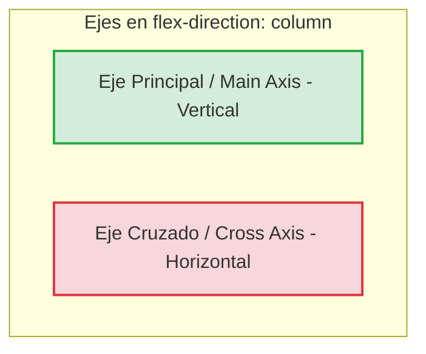
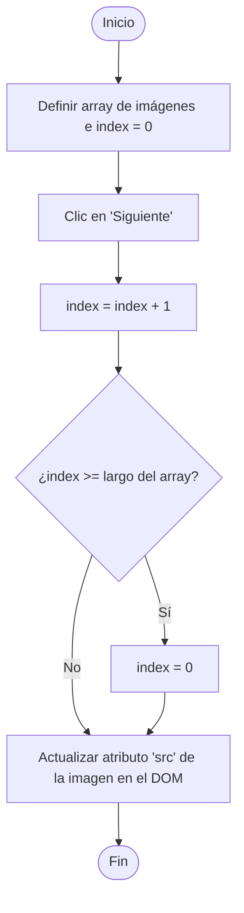
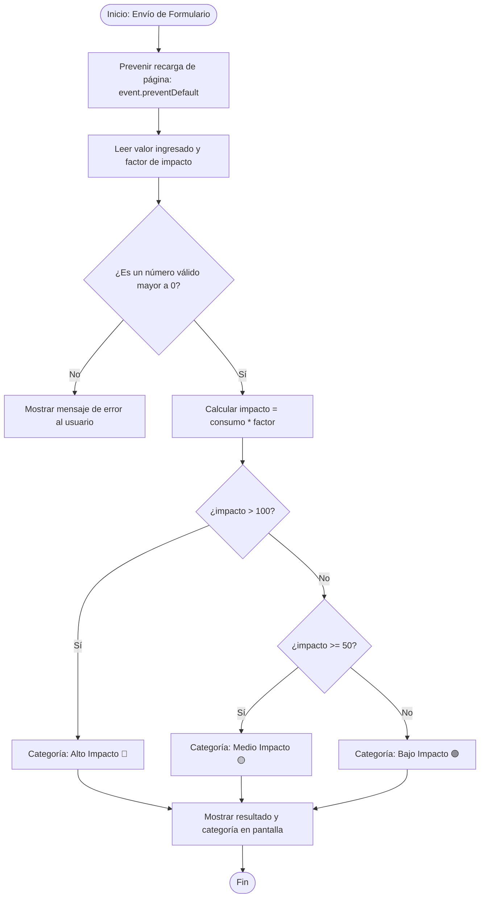

# Guía de Estudio y Resumen: Desarrollo Web (UADE)

Este documento es una guía interactiva y detallada diseñada para ayudarte a repasar los conceptos fundamentales de la materia, enfocándose en CSS avanzado (posicionamiento, Flexbox, responsive) y la lógica de programación en JavaScript (DOM, formularios, modales, carruseles y algoritmos básicos).

---

## 1. Posicionamiento en CSS (`position`)

El posicionamiento determina cómo se colocan los elementos en el documento web y cómo interactúan entre sí dentro del flujo de la página.

### `static` vs `relative` vs `absolute`

| Valor de `position` | ¿Sigue el flujo normal? | ¿Responde a `top`, `bottom`, `left`, `right`? | ¿Respecto a qué se posiciona? | Caso de Uso Común |
| :--- | :--- | :--- | :--- | :--- |
| **`static`** | Sí (es el valor por defecto). | No. | Al flujo natural del documento. | Layouts normales. |
| **`relative`** | Sí (deja un "hueco" vacío donde habría estado). | Sí (desplaza el elemento sin alterar a los vecinos). | A su **propia posición original**. | Para desplazar ligeramente un elemento o actuar como **contenedor de referencia** para hijos absolutos. |
| **`absolute`** | No (sale por completo del flujo). | Sí (se ubica con precisión milimétrica). | Al **ancestro posicionado más cercano** (`relative`, `absolute` o `fixed`). Si no hay, a `<body>`. | Badges de notificación, menús desplegables, elementos decorativos superpuestos. |

> [!IMPORTANT]
> **El Truco del Contenedor Relative:**
> Si quieres posicionar un botón o elemento en la esquina exacta de una tarjeta (Card), debes ponerle `position: relative;` a la tarjeta (padre) y `position: absolute;` al botón (hijo). De lo contrario, el botón absoluto se posicionará respecto a la pantalla completa.

```css
/* Ejemplo Práctico */
.card-padre {
  position: relative; /* Contenedor de referencia */
  width: 300px;
  height: 200px;
  border: 1px solid #ccc;
}

.badge-hijo {
  position: absolute;
  top: 10px;
  right: 10px; /* Se pega arriba a la derecha de .card-padre */
  background-color: red;
  color: white;
}
```

---

### `fixed` vs `sticky`

| Característica | `position: fixed` | `position: sticky` |
| :--- | :--- | :--- |
| **Relación con el Scroll** | **Siempre** se queda inmóvil en el mismo lugar de la ventana gráfica (viewport), sin importar cuánto scroll se haga. | Se comporta como `relative` hasta que el scroll llega a un umbral definido (ej. `top: 0`), momento en el que se "pega" como `fixed`. |
| **Flujo del Documento** | Sale por completo del flujo. Los elementos contiguos suben para ocupar su espacio. | Mantiene su espacio en el flujo original. No altera los elementos circundantes al activarse. |
| **Límite de Acción** | Su contenedor es toda la ventana (pantalla). | Está limitado por los límites físicos de **su contenedor padre**. Si el padre sale de la pantalla, el elemento sticky también. |
| **Caso de uso típico** | Botón flotante de WhatsApp, barra de navegación superior persistente. | Cabeceras de tablas (`<th>`), barras de navegación de categorías internas. |

```css
/* Barra de navegación superior fija pase lo que pase */
.nav-fixed {
  position: fixed;
  top: 0;
  left: 0;
  width: 100%;
  z-index: 1000;
}

/* Título de sección que se queda arriba al scrollar, pero solo dentro de su contenedor */
.section-header-sticky {
  position: sticky;
  top: 0;
  background-color: white;
  z-index: 10;
}
```

---

## 2. Flexbox y la Lógica de Ejes

Flexbox es un modelo de diseño unidimensional (organiza elementos en filas **o** columnas). Para entender Flexbox, debes dominar el concepto de **Ejes**.

```mermaid
graph LR
    subgraph Ejes en flex-direction: row (Por Defecto)
        R1[Eje Principal / Main Axis - Horizontal]
        R2[Eje Cruzado / Cross Axis - Vertical]
    end
    style R1 fill:#d4edda,stroke:#28a745,stroke-width:2px
    style R2 fill:#f8d7da,stroke:#dc3545,stroke-width:2px
```



### Propiedades clave (El "Efecto Ranitas")

1. **`flex-direction`**: Define la dirección del Eje Principal.
   - `row` (defecto): Elementos horizontalmente de izquierda a derecha.
   - `column`: Elementos verticalmente de arriba a abajo.
2. **`justify-content`**: Alinea los elementos a lo largo del **Eje Principal**.
   - `flex-start`: Al principio.
   - `flex-end`: Al final.
   - `center`: Centrados.
   - `space-between`: Espaciados uniformemente (el primero al inicio, el último al final).
   - `space-around`: Espaciados con espacio equivalente a los lados.
   - `space-evenly`: Mismo espacio físico entre cualquier par de elementos y los bordes.
3. **`align-items`**: Alinea los elementos a lo largo del **Eje Cruzado**.
   - `stretch` (defecto): Estira los items para llenar el contenedor.
   - `flex-start`: Alineados al techo (arriba en row).
   - `flex-end`: Alineados al piso (abajo en row).
   - `center`: Centrados verticalmente.
   - `baseline`: Alineados según la línea base del texto.
4. **`align-self`**: Permite a un **único elemento** hijo invalidar la propiedad `align-items` del padre.
5. **`flex-wrap`**: Permite que los elementos salten de línea si no caben.
   - `nowrap` (defecto): Todo en una sola línea (se achican si es necesario).
   - `wrap`: Saltan a la siguiente línea si no hay espacio.

---

## 3. Media Queries y Flexbox Responsivo

Las Media Queries permiten aplicar estilos CSS específicos dependiendo de las características del dispositivo (principalmente el ancho de pantalla).

### Ejemplo del Footer que pasa a vertical en Mobile

Es muy común que en computadoras (Desktop) un footer tenga varias columnas lado a lado (Flex horizontal), pero en celulares (Mobile) queremos que esas columnas se apilen verticalmente (Flex vertical) para que sea legible.

#### HTML
```html
<footer class="main-footer">
  <div class="footer-col"><h3>Sobre Nosotros</h3><p>Info...</p></div>
  <div class="footer-col"><h3>Enlaces</h3><p>Contacto...</p></div>
  <div class="footer-col"><h3>Redes Sociales</h3><p>Instagram...</p></div>
</footer>
```

#### CSS (Enfoque Mobile-First)
El enfoque **Mobile-First** consiste en definir los estilos base para teléfonos móviles y luego usar Media Queries para añadir complejidad a pantallas más grandes.

```css
/* Estilos Base: Pantallas Pequeñas (Mobile) */
.main-footer {
  display: flex;
  flex-direction: column; /* Apilados verticalmente */
  gap: 20px;
  padding: 20px;
  background-color: #1a1a1a;
  color: white;
}

.footer-col {
  width: 100%; /* Ocupa todo el ancho en mobile */
}

/* Media Query: Pantallas Medianas/Grandes (Desktop) */
@media (min-width: 768px) {
  .main-footer {
    flex-direction: row; /* Se ponen uno al lado del otro */
    justify-content: space-between; /* Distribuidos */
  }
  
  .footer-col {
    width: 30%; /* Cada columna ocupa casi un tercio */
  }
}
```

> [!TIP]
> Al usar `min-width`, el navegador aplica las reglas de adentro del `@media` solo si la pantalla tiene **como mínimo** ese ancho (ej. 768px o más). Esto hace que tu CSS sea limpio y eficiente.

---

## 4. El Elemento `<picture>` para Diseño Adaptable

La etiqueta `<picture>` es un contenedor HTML que permite definir múltiples fuentes de imagen para que el navegador elija de forma inteligente la más adecuada según el tamaño de pantalla o soporte de formatos.

### Estructura y Funcionamiento
Contiene una o más etiquetas `<source>` y **siempre** termina con una etiqueta `` obligatoria (que sirve de fallback o respaldo si el navegador no entiende `<picture>`).

```html
<picture>
  <!-- Si la pantalla tiene un ancho mínimo de 1024px, usa esta imagen grande -->
  <source media="(min-width: 1024px)" srcset="banner-desktop.jpg">
  
  <!-- Si la pantalla tiene un ancho mínimo de 768px, usa esta mediana -->
  <source media="(min-width: 768px)" srcset="banner-tablet.jpg">
  
  <!-- Imagen por defecto para Mobile o si el navegador no soporta <picture> -->
  
</picture>
```

### ¿Por qué usarla en tu TP y parcial?
1. **Optimización de Rendimiento**: No descargas una imagen gigante de 2MB en un celular 4G.
2. **Dirección Artística**: Puedes usar una foto con encuadre vertical para celulares y una horizontal apaisada para monitores.
3. **Formatos Modernos**: Puedes ofrecer imágenes WebP o AVIF (mucho más livianas) y dejar un `.png` o `.jpg` tradicional como fallback.

---

## 5. JavaScript: Fundamentos Esenciales

JavaScript le da dinamismo e interactividad a nuestras páginas web.

### Variables: Declaración y Tipos

En JavaScript moderno declaramos variables de dos formas principalmente:
- `const`: Para valores que **no van a cambiar** de referencia. (¡Úsalo por defecto!).
- `let`: Para valores que **sí van a cambiar** (acumuladores, flags, contadores).
- `var`: **No recomendado** en JS moderno debido a problemas con el alcance (scope) de las variables.

#### Tipos de Datos Comunes
1. **Booleanos**: `true` o `false`.
2. **Textos (Strings)**: `"Hola UADE"`, `'desarrollo web'`, `` `Template literals con ${variable}` ``.
3. **Arrays (Arreglos)**: Colecciones ordenadas indexadas desde `0`.

#### Representación de un Objeto y Array (Ejemplo Messi)
```javascript
// Representando a Messi como un Objeto (para agrupar propiedades de una entidad)
const messi = {
  nombre: "Lionel",
  apellido: "Messi",
  edad: 38,
  estaActivo: true,
  clubes: ["Barcelona", "PSG", "Inter Miami"]
};

// Acceder a datos del objeto
console.log(messi.nombre); // "Lionel"
console.log(messi.clubes[0]); // "Barcelona" (primer elemento del array de clubes)

// Representando un Array de Jugadores (para listas de elementos similares)
const seleccionArgentina = [
  { nombre: "Lionel", apellido: "Messi", posicion: "Delantero" },
  { nombre: "Emiliano", apellido: "Martínez", posicion: "Arquero" },
  { nombre: "Rodrigo", apellido: "De Paul", posicion: "Mediocampista" }
];

// Acceder al apellido del Dibu Martínez
console.log(seleccionArgentina[1].apellido); // "Martínez"
```

---

## 6. Formularios HTML y su Captura en JavaScript

Para procesar información en el lado del cliente (JS), es vital construir formularios accesibles y bien estructurados en HTML.

### Atributos Clave e Inputs comunes

- **`type="text"`**: Para cadenas de texto generales.
- **`type="number"`**: Restringe la entrada a números. Acepta atributos `min`, `max` y `step`.
- **`type="email"`**: Valida automáticamente que la entrada tenga formato de correo electrónico (`nombre@dominio.com`).
- **`id`**: Identificador único para vincular con JavaScript (`document.getElementById`) y con la etiqueta `<label>`.
- **`name`**: Clave del dato cuando se envía el formulario al servidor.
- **`for` (en `<label>`)**: Debe coincidir con el `id` del input asociado. Permite que al hacer clic en el texto de la etiqueta, el cursor se enfoque automáticamente en el input.

### Estructura de un `<select>` (Desplegable)
```html
<label for="select-provincia">Selecciona tu provincia:</label>
<select id="select-provincia" name="provincia" required>
  <option value="" disabled selected>Selecciona una opción...</option>
  <option value="caba">Ciudad de Buenos Aires</option>
  <option value="pba">Provincia de Buenos Aires</option>
  <option value="cordoba">Córdoba</option>
  <option value="santa-fe">Santa Fe</option>
</select>
```

#### Capturando el valor con JavaScript:
```javascript
const formulario = document.getElementById("mi-formulario");
const selectProvincia = document.getElementById("select-provincia");

formulario.addEventListener("submit", function(evento) {
  evento.preventDefault(); // Evita que la página se recargue
  
  const provinciaSeleccionada = selectProvincia.value;
  console.log("Provincia elegida:", provinciaSeleccionada); 
  // Mostrará "caba", "pba", "cordoba", etc.
});
```

---

## 7. Manipulación del DOM: FlexNav (Menú Hamburguesa)

El típico ejercicio de navegación adaptativa (FlexNav) consiste en abrir y cerrar un menú lateral o desplegable al hacer clic en un botón "hamburguesa". Para esto, usamos la API del DOM a través de `classList`.

### Métodos de `classList`:
- **`classList.add("nombre-clase")`**: Añade la clase CSS al elemento (si ya la tiene, no hace nada).
- **`classList.remove("nombre-clase")`**: Remueve la clase CSS del elemento.
- **`classList.toggle("nombre-clase")`**: Si el elemento **tiene** la clase, la remueve. Si **no la tiene**, la añade. Es ideal para interruptores tipo "abrir/cerrar".

### Código de Ejemplo Práctico

#### HTML
```html
<header>
  <button id="btn-toggle-menu" class="menu-hamburger">☰</button>
  <nav id="navbar" class="nav-links">
    <a href="#">Inicio</a>
    <a href="#">Servicios</a>
    <a href="#">Contacto</a>
  </nav>
</header>
```

#### CSS
```css
/* Por defecto en mobile, escondemos el menú corriéndolo de la pantalla */
.nav-links {
  position: fixed;
  top: 0;
  right: -250px; /* Escondido a la derecha */
  width: 250px;
  height: 100vh;
  background-color: #333;
  transition: right 0.3s ease; /* Transición suave */
}

/* Clase activa que inyectaremos con JS */
.nav-links.active {
  right: 0; /* Entra a la pantalla */
}
```

#### JavaScript
```javascript
// 1. Guardar los elementos del DOM en variables
const botonMenu = document.getElementById("btn-toggle-menu");
const navbar = document.getElementById("navbar");

// 2. Escuchar el evento clic en el botón
botonMenu.addEventListener("click", function() {
  // 3. Alternar la clase 'active' para abrir y cerrar el menú
  navbar.classList.toggle("active");
});
```

---

## 8. Creación de un Modal Dinámico

Un modal es una ventana superpuesta que interrumpe la navegación del usuario para mostrar información o requerir una acción. Se compone de un fondo oscuro semitransparente (overlay) y la caja contenedora del modal en sí.

### Estructura HTML recomendada
```html
<!-- Botón para abrir el modal -->
<button id="btn-abrir-modal">Ver Detalles</button>

<!-- Contenedor general del Modal (Overlay) -->
<div id="modal-container" class="modal-overlay hidden">
  <div class="modal-content">
    <span id="btn-cerrar-modal" class="close-btn">&times;</span>
    <h2>Título del Modal</h2>
    <p>Este es el contenido explicativo del modal.</p>
    <button id="btn-aceptar">Aceptar</button>
  </div>
</div>
```

### CSS Esencial
```css
.modal-overlay {
  position: fixed;
  top: 0;
  left: 0;
  width: 100%;
  height: 100vh;
  background-color: rgba(0, 0, 0, 0.5); /* Fondo oscuro semitransparente */
  display: flex;
  justify-content: center;
  align-items: center;
  z-index: 2000;
}

/* Clase de utilidad para ocultar */
.hidden {
  display: none !important;
}

.modal-content {
  background-color: white;
  padding: 30px;
  border-radius: 8px;
  position: relative;
  width: 90%;
  max-width: 500px;
}
```

### Lógica de Control en JavaScript
```javascript
// Guardar referencias del DOM en variables
const btnAbrir = document.getElementById("btn-abrir-modal");
const btnCerrar = document.getElementById("btn-cerrar-modal");
const btnAceptar = document.getElementById("btn-aceptar");
const modal = document.getElementById("modal-container");

// Función para abrir modal
function abrirModal() {
  modal.classList.remove("hidden");
}

// Función para cerrar modal
function cerrarModal() {
  modal.classList.add("hidden");
}

// Asignar listeners de eventos
btnAbrir.addEventListener("click", abrirModal);
btnCerrar.addEventListener("click", cerrarModal);
btnAceptar.addEventListener("click", cerrarModal);

// Opcional: Cerrar haciendo clic fuera del modal (en el overlay)
modal.addEventListener("click", function(evento) {
  if (evento.target === modal) {
    cerrarModal();
  }
});
```

---

## 9. Lógica del Carrusel (Slide)

Para programar un carrusel que muestre diferentes imágenes al hacer clic en "Siguiente" o "Anterior", necesitamos un **Array** de imágenes, un **Índice actual** y una estructura condicional (`if` / `else`) para manejar los límites (volver al inicio si pasamos el final, o ir al final si retrocedemos de la primera).

### Diagrama de Flujo del Carrusel



---

### Pseudocódigo para escribir en el Examen Parcial

```
ALGORITMO Carrusel
VARIABLES:
    imagenes: ARRAY DE CADENAS = ["img1.jpg", "img2.jpg", "img3.jpg"]
    indiceActual: ENTERO = 0
    imgElemento: ELEMENTO_DOM

PROCEDIMIENTO Siguiente()
    indiceActual <- indiceActual + 1
    
    SI indiceActual >= longitud(imagenes) ENTONCES
        indiceActual <- 0
    FIN SI
    
    MOSTRAR_IMAGEN()
FIN PROCEDIMIENTO

PROCEDIMIENTO Anterior()
    indiceActual <- indiceActual - 1
    
    SI indiceActual < 0 ENTONCES
        indiceActual <- longitud(imagenes) - 1
    FIN SI
    
    MOSTRAR_IMAGEN()
FIN PROCEDIMIENTO

PROCEDIMIENTO MOSTRAR_IMAGEN()
    imgElemento.src <- imagenes[indiceActual]
FIN PROCEDIMIENTO
```

---

### Código JS real del Carrusel
```javascript
// Array con rutas de las fotos
const imagenes = ["messi1.jpg", "messi2.jpg", "messi3.jpg"];
let indiceActual = 0;

// Referencias de elementos HTML
const imgDisplay = document.getElementById("carrusel-img");
const btnSiguiente = document.getElementById("btn-sig");
const btnAnterior = document.getElementById("btn-ant");

function actualizarImagen() {
  imgDisplay.src = imagenes[indiceActual];
}

btnSiguiente.addEventListener("click", function() {
  indiceActual++;
  // Si llegamos al final del array, volvemos a la primera imagen (index 0)
  if (indiceActual >= imagenes.length) {
    indiceActual = 0;
  }
  actualizarImagen();
});

btnAnterior.addEventListener("click", function() {
  indiceActual--;
  // Si retrocedemos de la primera imagen, vamos a la última (largo - 1)
  if (indiceActual < 0) {
    indiceActual = imagenes.length - 1;
  }
  actualizarImagen();
});
```

---

## 10. Calculadora de Impacto

Una "Calculadora de Impacto" es un ejercicio recurrente donde se ingresan valores de consumo (ej. consumo eléctrico, uso de agua, kilómetros recorridos), se multiplican por un factor de impacto (huella de carbono, costo unitario) y se muestra un veredicto o resultado categorizado por niveles (Alto, Medio, Bajo).

### Diagrama de Flujo de la Calculadora de Impacto



---

### Pseudocódigo de la Calculadora de Impacto

```
ALGORITMO CalculadoraImpacto
VARIABLES:
    consumoKWh: REAL
    FACTOR_CO2: REAL = 0.45  // kg de CO2 por cada kWh
    huellaTotal: REAL
    categoria: CADENA

PROCEDIMIENTO Calcular(evento)
    Llamar a evento.preventDefault() // Evita recargar la página
    
    consumoKWh <- LEER_VALOR_NUMERICO("input-consumo")
    
    SI ES_NAN(consumoKWh) O consumoKWh < 0 ENTONCES
        MOSTRAR_MENSAJE("Por favor ingrese un número positivo válido.")
        RETORNAR
    FIN SI
    
    huellaTotal <- consumoKWh * FACTOR_CO2
    
    SI huellaTotal > 100 ENTONCES
        categoria <- "Alto Impacto Ambiental (Rojo)"
    SINO SI huellaTotal >= 50 ENTONCES
        categoria <- "Medio Impacto Ambiental (Amarillo)"
    SINO
        categoria <- "Bajo Impacto Ambiental (Verde)"
    FIN SI
    
    MOSTRAR_RESULTADO(huellaTotal, categoria)
FIN PROCEDIMIENTO
```

---

### Código JS de la Calculadora de Impacto
```javascript
const formularioCalc = document.getElementById("form-calculadora");
const inputConsumo = document.getElementById("consumo-kwh");
const contenedorResultado = document.getElementById("resultado-impacto");

const FACTOR_CO2 = 0.45; // 0.45 kg CO2 por cada kWh consumido

formularioCalc.addEventListener("submit", function(event) {
  event.preventDefault(); // Evitamos recarga
  
  // Convertimos el valor ingresado a número decimal (float)
  const consumo = parseFloat(inputConsumo.value);
  
  // Validación de seguridad
  if (isNaN(consumo) || consumo < 0) {
    contenedorResultado.innerHTML = `<p class="error">Por favor ingresa un consumo válido.</p>`;
    return;
  }
  
  // Cálculo
  const huellaTotal = consumo * FACTOR_CO2;
  let categoria = "";
  let claseCSS = "";
  
  // Lógica condicional
  if (huellaTotal > 150) {
    categoria = "Alto";
    claseCSS = "impacto-alto"; // Clase CSS para pintar de rojo
  } else if (huellaTotal >= 50) {
    categoria = "Medio";
    claseCSS = "impacto-medio"; // Clase CSS para pintar de amarillo
  } else {
    categoria = "Bajo";
    claseCSS = "impacto-bajo"; // Clase CSS para pintar de verde
  }
  
  // Renderizado en el DOM
  contenedorResultado.innerHTML = `
    <div class="card-resultado ${claseCSS}">
      <p>Tu huella es de: <strong>${huellaTotal.toFixed(2)} kg de CO2</strong></p>
      <p>Nivel de impacto: <strong>${categoria}</strong></p>
    </div>
  `;
});
```
